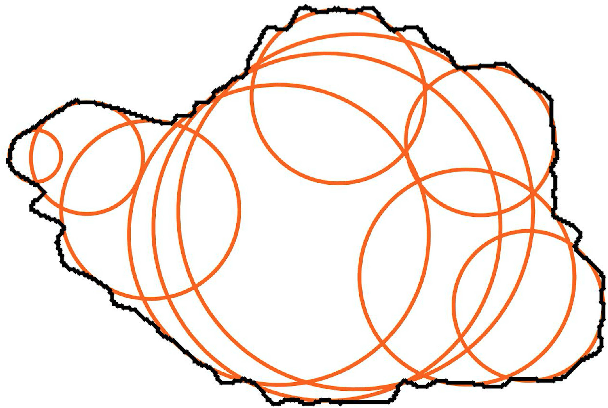
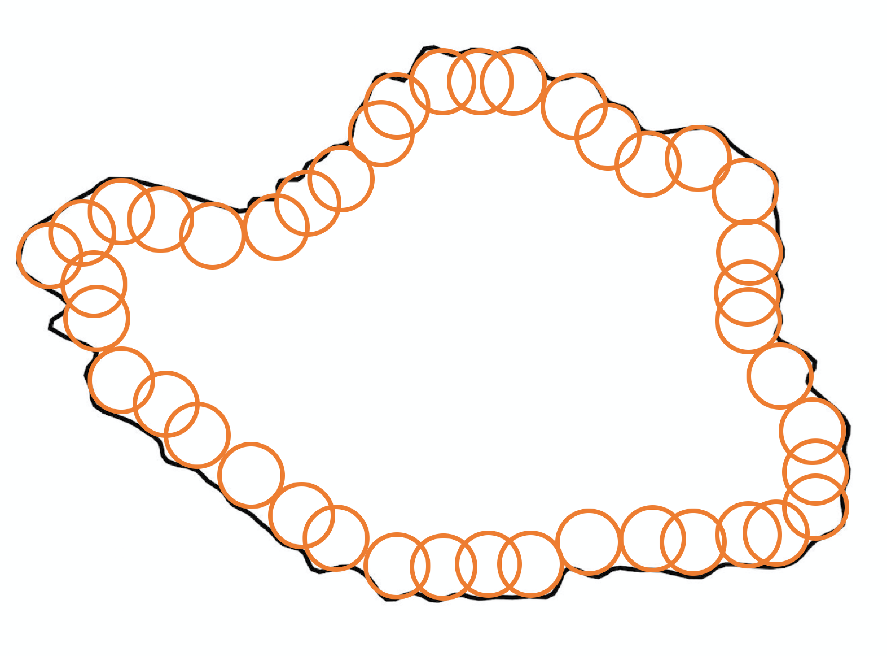
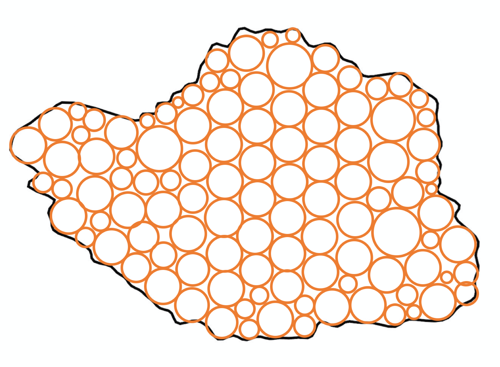
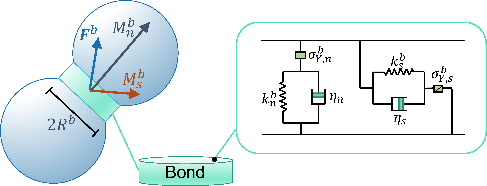

This section presents a brief introduction and review of the discrete
element method (DEM). The intention is to introduce the main components
and basic computational workflow of a DEM model, providing necessary
background information to the research presented in this dissertation.

## Overview

DEM is a particle-based numerical model that is particularly suitable
for describing the mechanical behavior of bulk granular materials. It
was first proposed by @Cundall.Strack:1979 for the analysis of
geotechnical materials. Since then, DEM has been applied to model all
kinds of granular materials and to simulate the problems ranging from
solids handling to powder flowing in a variety of different engineering
branches [@Cleary:2009; @Tijskens.etal:2003; @OSullivan:2011]. In DEM,
all individual particles in the bulk granular material are explicitly
modeled and a DEM model directly captures the interactions between
particles and tracks the motions of each particle. The bulk behavior of
a granular material is presented as an assembly of the actions (i.e.,
the interactions and motions) of all constituent particles.

As a particle-based numerical model, DEM exhibits several advantages
compared to the classical continuum theory-based numerical models.
First, it bypasses the phenomenological constitutive models for
describing the bulk behavior of a granular material within a
representative volume
[@Andrade.Avila:2012; @Andrade.etal:2012; @Guo.Zhao:2016]. Second, it is
straightforward for the DEM to simulate the problems involving large
deformation or material failure, such as granular flow, penetration, or
strain localization [@Chen:2011]. The major drawback of DEM is also
obvious. As DEM tracks the interactions and motions of all particles,
DEM simulations are quite computationally expensive, which makes it
difficult to scale up [@Liu.Hrenya:2014; @Berger.Hrenya:2014].
Nevertheless, with the advent of computer hardware and parallel
capabilities, the DEM has become an increasingly powerful numerical tool
that can provide valuable information of and shed lights upon the
microscopic behavior of granular materials, which is often difficult or
impossible to obtain from classical continuum-based numerical models or
from physical experiments.

## Key components of DEM

### Basic elements

In general, there are two types of basic elements in a DEM model:
particles and boundaries. The basic elements are assumed to be rigid but
can have overlaps with each other. A particle is a body that has a
closed surface. It may be represented by a simple geometry (e.g., sphere
or ellipsoid) or a composition of several simple geometries that make up
the body surface (see further discussions in ). A review on the particle
geometric representations can be found in [@Zhong.etal:2016]. Particles
have mass and their motion (i.e., position, velocity, and acceleration)
is always tracked during a DEM simulation. Boundaries are also referred
to as walls in the DEM literature. They may as well be represented by
simple geometries (e.g., triangles) or their combinations, but they do
not necessarily have closed surfaces. Boundaries do not have mass and
their position and velocity are usually prescribed to provide the
desired constraints to the particles in the model.

### Contacts and contact models

Contacts describe the interactions between basic elements. Contact
occurs when the surfaces of two basic elements overlap with each other
(to model collisions), or when the surfaces are within a specified
distance (to model long-range bond or cohesion). Detecting the contacts
between basic elements is a mathematical geometry problem and is one of
the most time-consuming parts of a DEM simulation. One important task
associated with contact detection is to characterize the contact
geometric features, which are needed by a contact model to calculate the
contact forces and moments. The contact features may include the
overlapping (or indentation) distance, relative shear displacement,
contact point, contact branch vectors, and so on.

Contact models are used to calculate the contact forces and moments
between the two elements in contact. Commonly used contact models
include the linear elastic model [@Cundall.Strack:1979], the rolling
resistance model [@Jiang.etal:2005], the Hertz-Mindlin model
[@Hertz:1882; @Mindlin:1953; @Renzo.Maio:2005], and the linear parallel
bond model [@Potyondy.Cundall:2004]. The formulation of these contact
models will be presented in .

### Newton-Euler equations of motion

In DEM, the motion of a particle can be described by the Newton-Euler
equations of motion. For any arbitrarily-shaped particle, the
Newton-Euler equations of motion are written as

$$\begin{aligned}
m\boldsymbol{a} &= \boldsymbol{F} \\
\boldsymbol{I}\boldsymbol{\alpha}+\boldsymbol{\omega}\times L &= \boldsymbol{M}\end{aligned}$$

where $m$ is the mass of the particle; $\boldsymbol{I}$ is the inertia tensor
of the particle; $\boldsymbol{a}$ and $\boldsymbol{\alpha}$ are the translational and
rotational acceleration; $\boldsymbol{F}$ and $\boldsymbol{M}$ are the overall
external forces and moments acting on the particle; $\boldsymbol{\omega}$ is
the vector of the angular velocities about the principal axes. Herein,
the variable in bold-symbol indicates a vector or a tensor. For
spherical particles, the Newton-Euler equations of motion reduce to

$$\begin{aligned}
  m\boldsymbol{a} &= \boldsymbol{F} \\
  \boldsymbol{I}\boldsymbol{\alpha} &= \boldsymbol{M}\end{aligned}$$

In order to resolve the motion of each particle, all the forces and
moments acting on the particle need to be evaluated and summed, which
may include gravity, damping, contact forces and moments, and prescribed
external forces and moments. Herein, the damping refers to the global
damping, which is sometimes (artificially) introduced in a DEM model to
facilitate energy dissipation and enhance a quasi-static simulation
[@Chung:2006; @PFC:2014]. There is another type of damping called local
damping, which is usually incorporated into a contact model as dash-pot
forces to account for the realistic energy dissipation due to particle
interactions.

### Time integration

To fully resolve the particle motion (e.g., the position and velocity)
governed by and involves the time integration scheme, where the
second-order Velocity Verlet algorithm [@Verlet:1967] is commonly
adopted. For spherical particles, suppose that the current state is
indexed by time $t$ and the time increment to the next state is
$\Delta t$, Velocity Verlet algorithm first calculates the particle
velocities at time $t$+$\Delta t/2$ by

$$\begin{aligned}
  \boldsymbol{v}^{t+\Delta t/2} &= \boldsymbol{v}^t 
    + \boldsymbol{a}^t\Delta t/2 \\
  \boldsymbol{\omega}^{t+\Delta t/2} &= \boldsymbol{\omega}^t 
    + \boldsymbol{\alpha}^t\Delta t/2\end{aligned}$$

where $\boldsymbol{v}$ and $\boldsymbol{\omega}$ are translational and angular
velocities, respectively. The superscripts (e.g., $t$ and $\Delta t/2$)
indicate the time indexes. Then, the position and orientation of the
particle at time $t$+$\Delta t$ are calculated as

$$\begin{aligned}
  \boldsymbol{x}^{t+\Delta t} &= \boldsymbol{x}^t 
    + \boldsymbol{v}^{t+\Delta t/2}\Delta t \\
  \boldsymbol{\theta}^{t+\Delta t} &= \boldsymbol{\theta}^t 
    + \boldsymbol{\omega}^{t+\Delta t/2}\Delta t \end{aligned}$$

where $\boldsymbol{x}$ is the vector of position and $\boldsymbol{\theta}$ is the
vector of orientation. Correspondingly, the translational velocity and
angular velocity at time $t+\Delta t$ are updated by

$$\begin{aligned}
  \boldsymbol{v}^{t+\Delta t} &= \boldsymbol{v}^{t+\Delta t/2} 
    + \boldsymbol{a}^{t+\Delta t/2}\Delta t/2 \\
  \boldsymbol{\omega}^{t+\Delta t} &= \boldsymbol{\omega}^{t+\Delta t/2} 
    + \boldsymbol{\alpha}^{t+\Delta t/2}\Delta t/2  \end{aligned}$$

For non-spherical particles, the original Newton-Euler equations of
motion cannot be simplified, and the calculation of the orientations and
angular velocity will be much more complicated. A more detailed
discussion on the time integration for non-spherical particles will not
be included here but can be found in the work of @Chung:2006 and the PFC
user manual [@PFC:2014].

### Critical timestep

The time integration based on the second-order Velocity Verlet algorithm
is numerically stable only when the time increment being used is less
than a threshold value, i.e. the critical timestep [@Otsubo.etal:2017].
If a time increment greater than the critical timestep is used,
particles may move too much in one increment, which will result in
spuriously infinite overlapping (i.e., abnormally large contact forces).

A summary and empirical assessment of different approaches to estimate
the critical timestep for DEM simulations can be found in
@Otsubo.etal:2017. Basically, there are two categories of approaches to
estimate the critical timestep: the oscillation period of a single
degree of freedom system (SDOF) based approaches
[@Cundall.Strack:1979; @Hart.etal:1988], and the Rayleigh wave speed
based approaches [@Thornton:2000; @Li.etal:2005]. The former approaches
consider the DEM system to be consist of rigid bodies connected by
springs, while the latter ones consider the particles themselves to be
springs.

In the category of the SDOF-based approaches, @Cundall.Strack:1979
proposed the following expression to estimate the critical timestep
$\Delta t_\text{crit}$

$$\Delta t_\text{crit} 
    = \min(\sqrt{m/k^\text{tran}}, \sqrt{I_i/k_i^\text{rot}})$$

where $m$ is the mass of the particle; $I_i$ is the moment of inertia of
the particle; $k^\text{tran}$ and $k_i^\text{rot}$ represent the
translational and rotational stiffness, and the subscript $i$ indicates
the index of principal components.

In the category of the Rayleigh wave speed based approaches,
@Li.etal:2005 proposed that

$$\Delta t_\text{crit} 
    = \frac{\pi R \sqrt{\rho/G}}{0.1631\nu+0.8766}$$

where $R$ is the average particle radius; $\rho$ is the particle
density; $G$ the particle shear modulus; and $\nu$ the Poisson's ratio
of the particle.

### Computational workflow

DEM-based numerical simulations require cyclic calculations. shows the
workflow and calculations that are involved in one typical cycle of a
DEM simulation.

{:style="width:80%"}

The workflow and calculations for one DEM cycle can be summarized as
follows:

1.  At the current state, the positions and velocities of all particles
    are known: based on the geometries of all particles, identify the
    inter-particle contacts and evaluate contact features;

2.  Calculate the external forces and moments of all particles, while
    the contact forces and moments are calculated based on selected
    contact models and the corresponding contact features;

3.  Calculate the motion (i.e., the accelerations) of all particles;

4.  Update the positions and velocities of all particles following the
    selected time integration scheme.

## Particle representation 

There are basically two groups of methods to represent an irregular
particle in DEM [@Zhong.etal:2016]: single-particle method and
composite-particle method.

### Single-particle method

The single-particle method utilizes closed geometries to represent
particle shapes. Many single-particle-based DEM models have been
proposed and developed with the adoption of some specific closed
geometries, such as cylinder [@Feng.etal:2017], polyhedron (or polygon
in 2D) [@Nassauer.etal:2013; @Daddetta.etal:2002], ellipsoid (or ellipse
in 2D) [@Lin.Ng:1997; @Ting.etal:1993], superquadrics
[@Williams.Pentland:1992; @Podlozhnyuk.etal:2017], Non-Uniform Rational
Basis Spline (NURBS) [@Andrade.etal:2012], as well as their combinations
(e.g., poly-ellipsoid [@Peters.etal:2009; @Zhang.etal:2017]).

Each of these methods has its own advantages and limitations. The
application of the cylinder-based or ellipsoid-based DEM models is
limited, due to the particular particle shapes they can represent. The
superquadric can be considered as an extension of the ellipsoid and can
be used for modeling of spheres, ellipsoids, cylinder-like and
box(dice)-like particles by varying the shape parameters. It is more
flexible by being able to model larger variations of particle shapes,
but also more computationally expensive than the ellipsoid-based DEM
models. The polyhedron- (or polygon in 2D) based DEM model is able to
replicate arbitrary particle shapes. The accuracy of the shape
represented by polyhedron depends on the number of faces in a
polyhedron, whereas a large number of faces would hinder the
computational efficiency. Moreover, polyhedron can rarely replicate a
smooth particle shape. The NURBS based granular element method,
developed by @Andrade.etal:2012, is advantageous to replicate general
and smooth particle shapes, whereas it is computationally expensive
compared to the polyhedron-based DEM.

Recently, @Kawamoto.etal:2016 developed another novel type of
single-particle-based DEM, which utilizes the level set (LS) method to
represent particles. The LS-DEM seamlessly utilizes the level set data
of realistic particle shapes characterized from X-ray computational
tomography and is computationally efficient. One issue with the LS-DEM
is high memory consumption, which somewhat limits its application on
large particulate systems.

### Composite-particle method

In a composite-particle method, a particle is represented by
compositions of simple geometries (usually spheres in 3D or circles in
2D [@Das:2007; @Shi.etal:2015]). This group of methods is advantageous
to implementation for that the contact detection and resolution
algorithms for the simple geometries can be effortlessly exploited. It
should be noted that the accuracy of particle shape represented by
compositions of simple geometries depends on the amount of the simple
geometries, and a large number of simple geometries would lead to great
computational expense though. Nonetheless, the composite-particle method
(especially with spheres as the base elements) is currently the most
prevalent method to model irregular particles and is supported in most
commercial or open-source DEM packages such as PFC [@PFC:2014] and
LIGGGHTS [@Kloss.etal:2012].

There are three options to represent a composite particle
[@Shi.etal:2015]: the domain overlapping filling method, the domain
non-overlapping filling method, and the boundary filling method, as
shown in with discs being used as the base elements, for instance. The
composite particle generated by domain overlapping filling requires the
least number of particles and is, therefore, the most computationally
efficient. The domain non-overlapping filling method can be promoted to
model physics-based particle deformation (e.g., compression, deflection
or distortion) or breakage. The boundary filling method, depending on
the size of filling elements, could provide a better representation of
surface roughness.

{:style="width:32%"}
{:style="width:32%"}
{:style="width:32%"}

A schematic illustration of the three options to represent a composite particle with discs (modified after [@Shi.etal:2015])

## Contact models 

A DEM contact model is normally comprised of springs, dash-pots, and
sliders to describe the force-displacement behavior at the contact,
where the springs account for normal and tangential forces, the
dash-pots account for local damping, and the sliders account for shear
failure. The formulation of contact models that will be used in this
dissertation is presented in this section.

### Linear elastic model

A linear elastic model generally consists of two elastic springs, two
dash-pots, and a slider, as shown schematically in the following.

."){:style="width:60%"}

The contact forces $\boldsymbol{F}$ are calculated from two parts: the normal
force $\boldsymbol{F}_n$ and the shear (or tangential) force $\boldsymbol{F}_s$

$$\boldsymbol{F} = \boldsymbol{F}_n + \boldsymbol{F}_s
    = F_n\boldsymbol{n}_n + F_s\boldsymbol{n}_s$$

where $\boldsymbol{n}_n$ and $\boldsymbol{n}_s$ are the unit vectors denoting the
direction of the normal and the shear force, respectively; $F_n$ and
$F_s$ are the magnitudes of corresponding contact forces. Assuming the
relative displacement increment at the contact during a timestep
$\Delta t$ is given by its components $\Delta \delta_n$ (compression as
a positive) and $\Delta \delta_s$, the contact law for a simple linear
model with local damping updates the contact forces through
[@Cundall.Strack:1979; @PFC:2014] 

$$\begin{aligned}F_n &= F_n^0 + k_n\Delta\delta_n 
    - \eta_n\sqrt{\bar{m}k_n}\dot{\delta}_n \\
  F_s &= \min(F_s^0 + k_s\Delta\delta_s 
    - \eta_s\sqrt{\bar{m}k_s}\dot{\delta}_s, \mu_c F_n)\end{aligned}$$

where $F_n^0$ and $F_s^0$ are the normal and the shear forces at the
beginning of the current timestep, respectively; $k_n$ and $k_s$ are the
corresponding stiffness; $\eta_n$ and $\eta_s$ are the corresponding
damping coefficients; $\dot{\delta}_n$ and $\dot{\delta}_s$ are the
relative normal and shear velocity; $\mu_c$ is the contact friction
coefficient; and $\bar{m} = m_im_j/(m_i+m_j)$ is the effective mass of
particles $i$ and $j$ associated with the contact, while $\bar{m} = m_i$
for the case of particle-boundary contact.

### Rolling resistance model

The rolling resistance model is built upon the linear elastic model by
adding a term of rolling resistance moment to the contact moment. The
formulation to calculate the additional rolling resistance moment can be
written as [@Iwashita.Oda:1998; @Jiang.etal:2005; @PFC:2014]

$$M = \min(M^0 + k_r\Delta\theta_b, \mu_r \bar{R} F_n)$$

where $M^0$ is the contact moment at the beginning of the current
timestep; $\Delta\theta_b$ is the relative bending-rotation increment;
$\mu_r$ is the rolling resistance coefficient; $k_r$ is the rolling
resistance stiffness defined as:

$$k_r = k_s\bar{R}^2$$

where $\bar{R}$ is the contact effective radius defined as
$\bar{R}=R_iR_j/(R_i+R_j)$, in which $R_i$ and $R_j$ are the radii of
the contact particles. If one side of the contact is a wall, the
corresponding radius $R_j \rightarrow \infty$.

This model uses a simplified formulation for the rolling kinematics, and
the particle size effects on the rolling resistance are implicitly
incorporated in the rolling stiffness term. The interested reader is
referred to [@Luding:2008; @Wang.etal:2015] for examples of improved and
more advanced rolling resistance models.

### Hertz-Mindlin model

The Hertz-Mindlin model is a complete frictional contact model based
upon the Hertz theory [@Hertz:1882] for contact normal forces and the
Mindlin theory [@Mindlin:1953] for contact tangential forces. It takes
into account the stiffness variation due to the change of contact areas
during the collision of two elastic spheres.

Similar to the linear elastic model, the Hertz-Mindlin model also
consists of two springs, two dash-pots, and a slider. There are,
however, two major differences. First, the normal and shear stiffness in
the Hertz-Mindlin model are functions of the contact overlapping
distance. Second, the normal contact force in the Hertz-Mindlin model is
calculated via the cumulative overlapping distance, while the linear
elastic model uses either the cumulative or incremental overlapping
distance. To update the contact forces, the Hertz-Mindlin model follows

$$\begin{aligned}
    F_n &= k_n \delta_n 
      - \eta_n\sqrt{\bar{m}k_n}\dot{\delta}_n \\ 
    F_s &= \min(F_s^0 + k_s\Delta\delta_s 
    - \eta_s\sqrt{\bar{m}k_s}\dot{\delta}_s, \mu_c F_n) \end{aligned}$$

where $\delta_n$ is the cumulative overlapping distance, while $k_n$ and
$k_s$ are calculated as [@Renzo.Maio:2005]:

$$\begin{aligned}
  k_n &= \frac{4}{3}\bar{E}\sqrt{\bar{R}\delta_n} \\
  k_s &= 8\bar{G}\sqrt{\bar{R}\delta_n} \end{aligned}$$

in which

$$\begin{aligned}
 \frac{1}{\bar{E}} &= \frac{(1-\nu_i^2)}{E_i} 
   + \frac{(1-\nu_j^2)}{E_j} \\
 \frac{1}{\bar{G}} &= \frac{2(2-\nu_i)(1+\nu_i)}{E_i} 
   + \frac{2(2-\nu_j)(1+\nu_j)}{E_j} \end{aligned}$$

where $\bar{E}$ and $\bar{G}$ are the effective Young's modulus and
shear modulus of the particles in contact; $E_i$ is the Young's modulus
and $\nu_i$ is the Poisson's ratio of the $i$th particle.

### Linear parallel bond model

The linear parallel bond model describes the contact behavior of two
bonded particles, as shown schematically in the following.

{:style="width:60%"}

In the linear parallel bond model, the bond between two spheres is
assumed to be a cylinder of finite radius and thickness. Each point in
the bond is imposed by two linear elastic springs providing normal and
shear resistances, respectively. The overall bonding force and moment
are the integral of the normal and shear stresses at a cross-section of
the bond, which can be calculated as [@Potyondy.Cundall:2004]

$$\begin{aligned}
  \Delta F_n^b &= k_n^b A \Delta \delta_n \\  
  \Delta F_s^b &= k_s^b A \Delta \delta_s \\
  \Delta M_n^b &= k_s^b J \Delta \theta_n \\
  \Delta M_s^b &= k_n^b I \Delta \theta_s\end{aligned}$$

where $F_n^b$, $F_s^b$, $M_n^b$ and $M_s^b$ are the bond normal force,
shear force, twisting moment, and swinging moment, respectively;
$\delta_n$, $\delta_s$, $\theta_n$, and $\theta_s$ are the relative
normal displacement, shear displacement, twisting rotation, and swinging
rotation between the two bonded spheres, respectively; $A$, $I$, and $J$
are the area, moment of inertia, and polar moment of inertia of the bond
(i.e., the circular cross-section with radius $R^b$), respectively; and
$\Delta$ indicates the increment of each variable in each time step. It
should be pointed out that, while the damping is not included in the
current formulation, damping terms similar to those in the linear
elastic model can be incorporated in a straightforward manner.

The bonded-sphere model is also capable of modeling the particle
breakage behavior. As an example of a common bond breakage criterion, it
can be assumed that a bond would break if the maximum normal or shear
stress at the bond exceeds the corresponding normal or shear strength.
In the linear parallel bond model, both the normal force and swinging
moment contribute to the normal stress, while both the shear force and
twisting moment contribute to the shear stress. In this regard, the bond
breakage criterion can be written as

$$\begin{aligned}
  \sigma_{\max}^b &= \frac{F_n^b}{A}+\frac{M_s^bR^b}{I} 
    < \sigma_{Y,n}^b \\
  \tau_{\max}^b &= \frac{F_s^b}{A}+\frac{M_n^bR^b}{J} 
    < \sigma_{Y,s}^b  \end{aligned}$$

where $\sigma_{Y,n}^b$ and $\sigma_{Y,s}^b$ are the normal and shear
strength, respectively.

## Model calibration

As most of the contact parameters in a DEM model are difficult if not
impossible to be measured directly from physical tests, a calibration
process is often needed to obtain the contact parameters for a specific
material of interest. There are some researches available on the
procedures to calibrate contact parameters for a DEM model
[@Plassiard.etal:2009; @Chehreghani.etal:2017; @Coetzee:2017]. Usually,
the calibration process is accomplished by performing parametric studies
on each of contact parameters and selecting values of the contact
parameters with which the DEM simulation can reproduce the benchmark
matrices of laboratory experiments. Commonly used laboratory experiments
for calibration of DEM parameters include compression test, direct and
ring shear test, and angle of repose test. Descriptions of these tests
can be found in [@Schulze:2008; @Coetzee:2017].

There are some challenges and problems associated with the model
calibration. First, to obtain reasonable and realistic contact
parameters via calibration, it is necessary that the setup and
procedures in the DEM models are to the most extent similar to those in
the laboratory experiments. However, in order to get the DEM simulations
performed within affordable computational resources, adjustments or
tolerances in the particle size, shape or testing speed may exist in a
DEM model. As a result, the calibrated contact parameters may deviate
from their actual values to some degree. In addition, the contact
features and contact models are usually quite simple and conceptual
compared to the actual complex contact behavior. The physical meaning of
the contact parameters may be lost due to the use of conceptualized
contact features and contact models. Lastly, as pointed out in
[@Coetzee:2017], the solution of contact parameters might not be unique
since all contact parameters may affect the results of a DEM simulation
in a complex and highly nonlinear manner. There is no guarantee that the
contact parameters for a material calibrated for one experiment will be
workable for another. In this regard, it would be necessary to perform
the calibration with one experiment and validate the calibration results
via another.

\bibliography